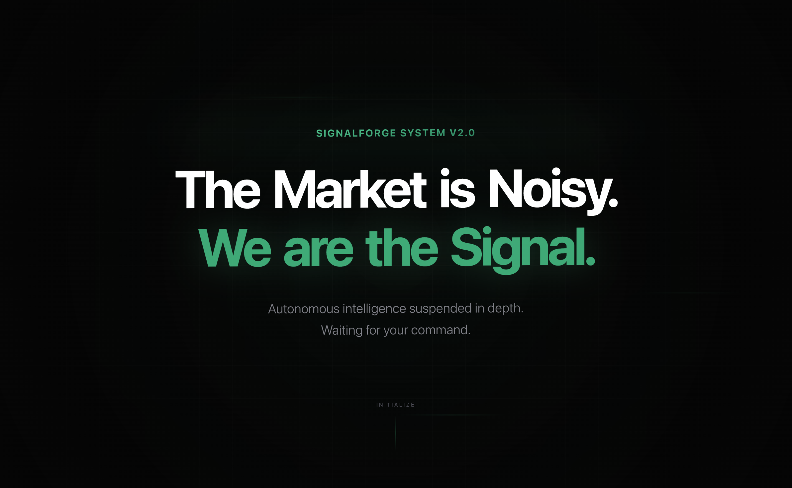
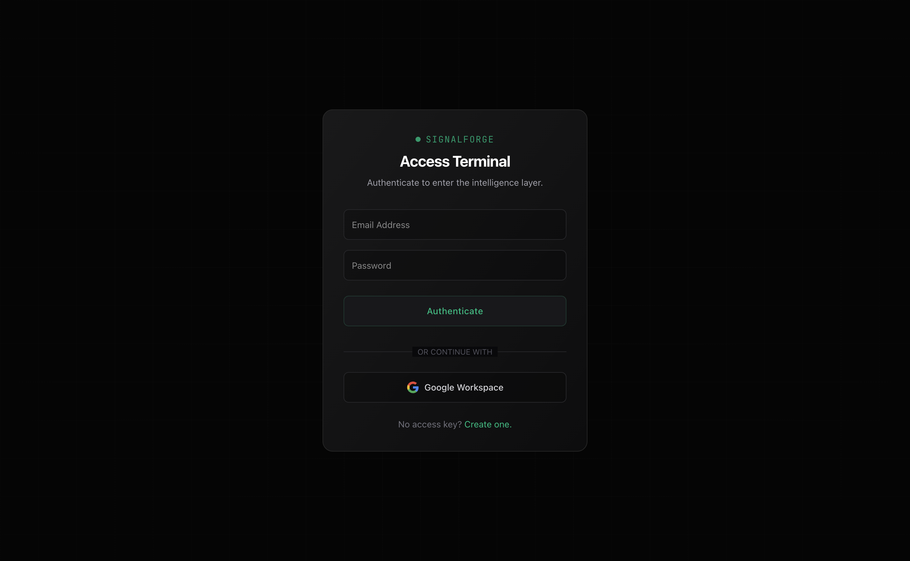
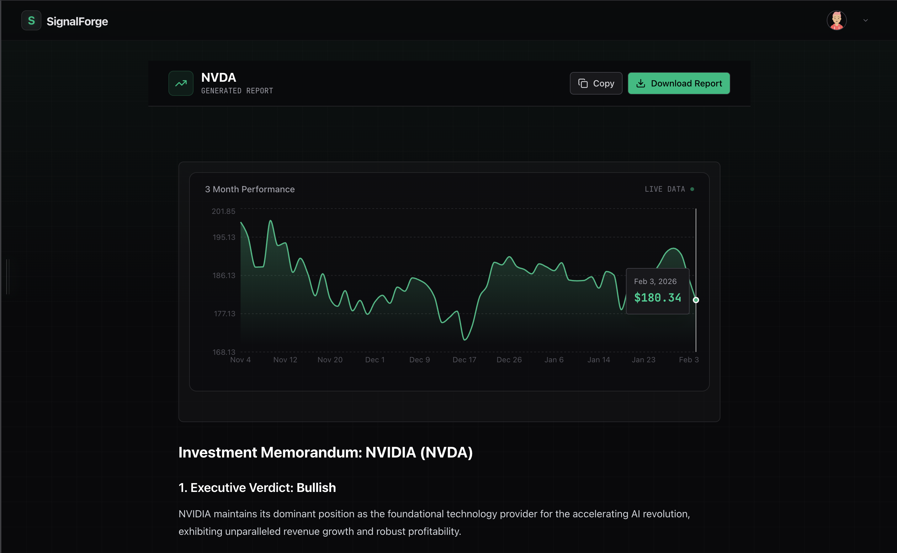
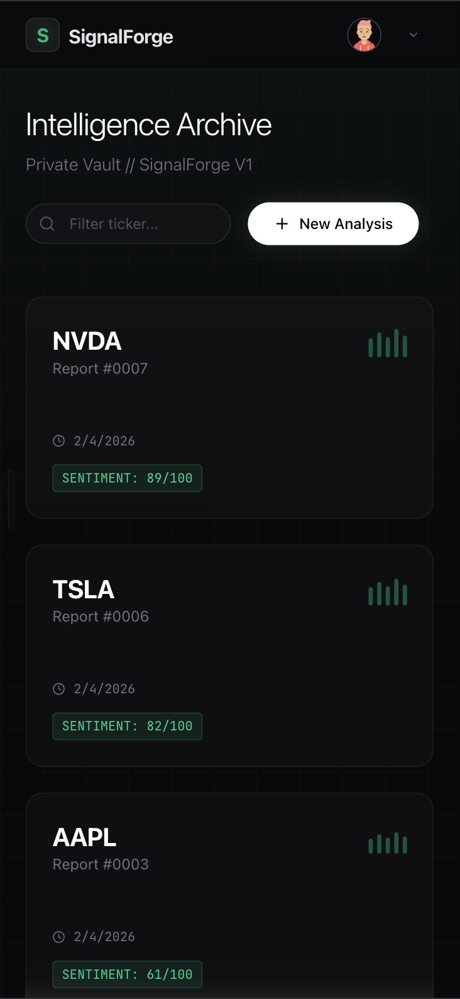
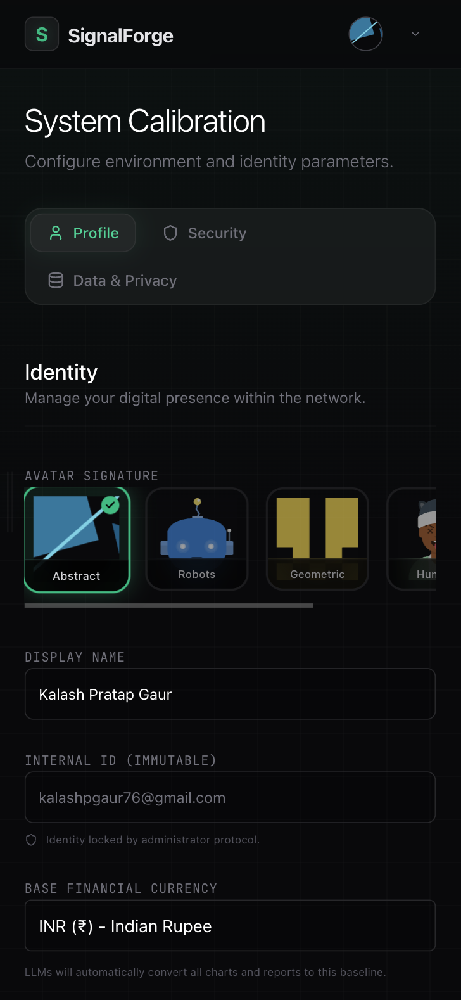

  <h1>Signal Forge</h1>
  
  

    <strong>The Autonomous Market Research Agent</strong>
  

  
  

    <a href="https://signalforge-oo7s.vercel.app/">🔴 Live Demo</a> • 
    <a href="#gallery">📸 Gallery</a> • 
    <a href="#tech-stack">🛠 Tech Stack</a> •
    <a href="#author">👨‍💻 Author</a>
  

  

    
    
    
    
    
  

 

  <strong>Signal Forge</strong> is an AI-powered financial analyst that lives in your browser. 
  Unlike simple chatbots, it uses <strong>LangGraph</strong> to orchestrate a multi-step research workflow. 
  It autonomously plans, searches live news (Tavily), analyzes market data (yfinance), and generates 
  institutional-grade investment memorandums with clear "Bullish/Bearish" verdicts.

---

<h2 id="gallery">📸 Gallery</h2>

<h3 align="center">🖥️ Desktop Experience</h3>

<table align="center">
  <tr>
    <td align="center" width="50%">
      <strong>Landing Page</strong> 
      <em>Clean, distraction-free entry point.</em> 
      
    </td>
    <td align="center" width="50%">
      <strong>Secure Authentication</strong> 
      <em>OAuth integration via Supabase Auth.</em> 
      
    </td>
  </tr>
  <tr>
    <td align="center" width="50%">
      <strong>The Agent at Work</strong> 
      <em>Real-time logging of reasoning steps.</em> 
      
    </td>
    <td align="center" width="50%">
      <strong>The Final Report</strong> 
      <em>Complete memo with charts & verdict.</em> 
      
    </td>
  </tr>
</table>

 

<h3 align="center">📱 Mobile Experience</h3>
<table align="center">
  <tr>
    <td align="center" width="50%">
      <strong>Dashboard (Mobile)</strong> 
      
    </td>
    <td align="center" width="50%">
      <strong>Settings (Mobile)</strong> 
      
    </td>
  </tr>
</table>

---

<h2 id="features">✨ Key Features</h2>

<ul>
  <li><strong>🧠 Agentic Workflow:</strong> Powered by <strong>LangGraph</strong> & <strong>LangChain</strong> to handle complex reasoning loops.</li>
  <li><strong>🚀 High-Performance Caching:</strong> Uses <strong>Redis</strong> (optional) for efficient state management and caching.</li>
  <li><strong>📊 Live Market Data:</strong> Fetches real-time price history and technicals using <code>yfinance</code>.</li>
  <li><strong>🌍 Real-Time News:</strong> Scrapes and synthesizes the latest financial news via <strong>Tavily API</strong>.</li>
  <li><strong>🔐 Secure Auth:</strong> Complete OAuth 2.0 implementation with Supabase Auth.</li>
  <li><strong>💾 Persistent History:</strong> Autosaves every report to <strong>Supabase</strong> (PostgreSQL) via SQLAlchemy.</li>
  <li><strong>🎨 Responsive UI:</strong> A "Soft Dark Mode" interface built with Tailwind CSS, optimized for both desktop and mobile.</li>
</ul>

---

<h2 id="tech-stack">🛠 Tech Stack</h2>

<table align="center">
  <tr>
    <td align="center"><strong>Frontend</strong></td>
    <td align="center"><strong>Backend & AI</strong></td>
    <td align="center"><strong>Data & Infra</strong></td>
  </tr>
  <tr>
    <td>Next.js 14 (App Router)</td>
    <td>Python 3.11 (FastAPI)</td>
    <td>Supabase (PostgreSQL)</td>
  </tr>
  <tr>
    <td>TypeScript</td>
    <td>LangChain & LangGraph</td>
    <td>Supabase Auth</td>
  </tr>
  <tr>
    <td>Tailwind CSS</td>
    <td>Google Gemini 2.5 Flash</td>
    <td>Redis (Caching)</td>
  </tr>
  <tr>
    <td>Framer Motion</td>
    <td>Tavily Search API</td>
    <td>Vercel & Render</td>
  </tr>
</table>

---

<h2 id="author">👨‍💻 Author</h2>

  <strong>Kalash Pratap Gaur</strong> 
  <a href="https://github.com/CaSh007s">@CaSh007s</a>

  Built with ❤️ using Google's GenAI Stack.

